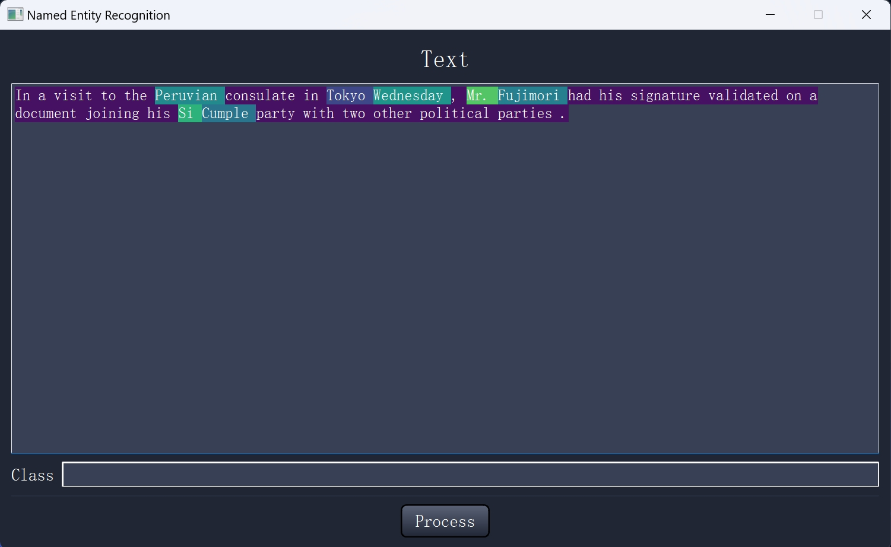

# Name Entity Recognition using DistilBERT

This project aims to perform NER using DistilBERT with the PyTorch (GUI included).


### Dataset: 
[NER Corpus](https://www.kaggle.com/datasets/naseralqaydeh/named-entity-recognition-ner-corpus?resource=download)


### Build: 

	CPU: Intel i9-13900H (14 cores)
	GPU: NVIDIA RTX 4060 (VRAM 8 GB)
	RAM: 32 GB


### Python Packages:

	conda install pytorch==2.1.2 torchvision==0.16.2 torchaudio==2.1.2 pytorch-cuda=12.1 -c pytorch -c nvidia
	conda install -c conda-forge opencv==4.6.0
	conda install -c conda-forge lightning==2.3.2
	pip install torcheval

### Code Structure:
```bash
├── GUI.py (Run to generate GUI)
├── main.py (Run to train model)
├── dataset.py
├── qt_main.ui
├── fine_tuning.py
├── label_ind_map.pkl
├── DistilBertForTokenClassification_finetuned.pth
├── nets
    ├── nn.py
    ├── summary.py
```

### Dataset Structure:
```bash
├── Named Entity Recognition (NER) Corpus
    ├── ner.csv
```


	